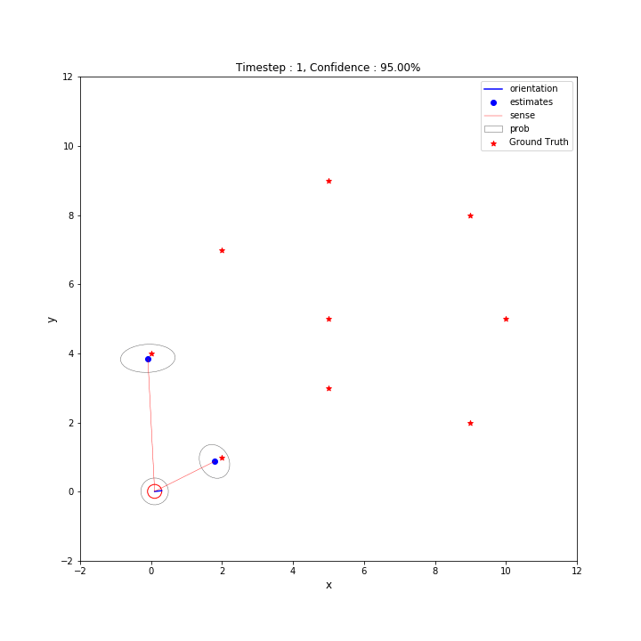

# Extended Kalman Filter:

The Extended Kalman Filter is a recursive state estimation algorithm which extends the Kalman Filter Algorithm to make it capable of handling non-linear functions. This is one of the most popular and easiest to use algorithms in the field of localisation and mapping.

This tutorial is in the form of a Python Notebook which first describes in detail what the algorithm tries to achieve and its pracitcal considerations and then implements the algorithm on a dataset to create plots and an animation.

The data has been taken from Frieburg University's Robotic Mapping course webpage. The original files were written in octave which can still be find in the octave folder. Initially there was some dependency on octave to read the data in the correct format however this dependency has now been eliminated by using custom read functions.

## Installing Dependencies

The most straight forward way to install all dependencies is to use pip to install modules from the req.txt file.

		`pip install -r req.txt`

## References
	1] Probabilstic Robotics, 2005, Sebastian Thrun, Wolfram Burgard and Dieter Fox.
		www.probabilistic-robotics.org

	2] Robotic Mapping Lectures, University of Freiburg, Cyrill Stachniss
		https://www.youtube.com/watch?v=U6vr3iNrwRA&list=PLgnQpQtFTOGQrZ4O5QzbIHgl3b1JHimN_

	3] Data, Robotic Mapping, Freiburg University
		http://ais.informatik.uni-freiburg.de/teaching/ws13/mapping/

ENJOY!

